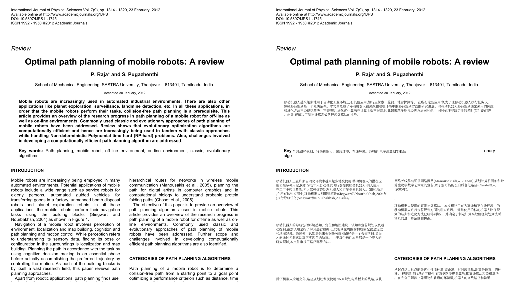

# PDF Translator EN-ZH

生成的PDF是中英对照的。

  

## Features

Thanks to [PDF Translator EN-JA](https://github.com/discus0434/pdf-translator)

为了方便看英文文献，在网上找了一些PDF翻译器，最后Fork上面的仓库，做了点修改。

# 使用方法：

按顺序执行以下操作（仅在windows11 x64进行了使用操作，不保证支持其他平台）：
0. 确保控制台cmd或powershell可以运行python，并具有git，cd到你常用的工作目录下
1. git clone https://github.com/babakara/pdf-translator
2. cd pdf-translator
3. python -m venv venv
4. pip install -r requirements.txt
5. python main.py

